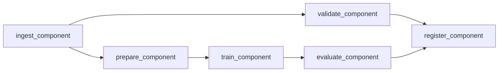

# mlops-benchmark-kubeflow

## Português

`mlops-benchmark-kubeflow` é um benchmark de MLOps organizado com a mentalidade de `Kubeflow Pipelines`, comparando múltiplos modelos em uma DAG com componentes explícitos de ingestão, validação, preparação, treino, avaliação e registro.

### Storytelling técnico

Em MLOps, benchmark não é apenas uma tabela de métricas. Para ser útil em produção, ele precisa nascer dentro de um fluxo reexecutável, em que cada componente deixe rastros claros dos dados usados, das métricas produzidas e do artefato promovido ao final. É esse tipo de disciplina operacional que ferramentas como Kubeflow ajudam a organizar.

Este projeto foi desenhado para mostrar exatamente isso. Em vez de treinar modelos em um notebook isolado, ele estrutura a comparação entre candidatos como uma DAG:

- ingestão do dataset;
- validação estrutural;
- split controlado;
- treino de múltiplos candidatos;
- avaliação com métrica de seleção;
- registro do modelo vencedor.

### Como pensar este benchmark com mentalidade Kubeflow

Kubeflow não entra aqui como “mais um jeito de rodar Python”. Ele entra como um modelo de organização do trabalho de ML:

- cada etapa precisa ter uma responsabilidade única;
- cada componente deve trocar artefatos explícitos com o próximo;
- a lógica de promoção do melhor modelo precisa ser determinística;
- o fluxo completo precisa ser reexecutável sem depender de estado implícito.

Este repositório traduz essa ideia para um benchmark supervisionado em que os componentes são desacoplados, os artefatos são persistidos em disco e a DAG fica documentada de forma declarativa.

### Componentes

- [src/data_factory.py](/Users/flaviagaia/Documents/CV_FLAVIA_CODEX/-mlops-benchmark-kubeflow/src/data_factory.py)
  gera e persiste a base sintética bruta;
- [src/components.py](/Users/flaviagaia/Documents/CV_FLAVIA_CODEX/-mlops-benchmark-kubeflow/src/components.py)
  implementa os componentes de ingestão, validação, preparação, treino, avaliação e registro;
- [src/pipeline_runner.py](/Users/flaviagaia/Documents/CV_FLAVIA_CODEX/-mlops-benchmark-kubeflow/src/pipeline_runner.py)
  executa a DAG localmente em ordem determinística;
- [pipeline.py](/Users/flaviagaia/Documents/CV_FLAVIA_CODEX/-mlops-benchmark-kubeflow/pipeline.py)
  escreve a especificação declarativa do pipeline no estilo Kubeflow;
- [main.py](/Users/flaviagaia/Documents/CV_FLAVIA_CODEX/-mlops-benchmark-kubeflow/main.py)
  consolida execução e materializa a referência do spec;
- [tests/test_pipeline.py](/Users/flaviagaia/Documents/CV_FLAVIA_CODEX/-mlops-benchmark-kubeflow/tests/test_pipeline.py)
  valida o contrato mínimo do benchmark.

### DAG



### Contrato de saída

O relatório consolidado do pipeline contém:

- `runtime_mode`
- `validation`
  estatísticas estruturais do dataset de entrada;
- `selected_model`
- `candidate_results`
  leaderboard com `roc_auc`, `average_precision` e `f1`;
- `model_artifact`
- `metrics_artifact`
- `leaderboard_artifact`
- `report_artifact`
- `pipeline_spec_artifact`

O projeto também persiste artefatos intermediários e finais:

- `data/raw/benchmark_dataset.csv`
- `data/processed/train.csv`
- `data/processed/test.csv`
- `data/processed/mlops_benchmark_report.json`
- `artifacts/best_model.joblib`
- `artifacts/benchmark_metrics.json`
- `artifacts/leaderboard.json`
- `artifacts/kubeflow_pipeline_spec.json`

### Resultados atuais

- `runtime_mode = local_kubeflow_style_benchmark`
- `row_count = 1400`
- `positive_rate = 0.5050`
- `selected_model = logistic_regression`

Resumo executivo do leaderboard:

- `logistic_regression`
  `roc_auc = 0.7959 | average_precision = 0.7971 | f1 = 0.7101`
- `linear_svc`
  `roc_auc = 0.7960 | average_precision = 0.7967 | f1 = 0.7387`
- `random_forest`
  `roc_auc = 0.7454 | average_precision = 0.7545 | f1 = 0.6628`

### Observações de benchmark

- O pipeline seleciona o vencedor com base em `average_precision`, priorizando robustez de ranking no benchmark.
- O dataset sintético atual é quase balanceado, então `average_precision` e `roc_auc` ficam relativamente próximos entre si.
- O valor principal do projeto está na organização do benchmark como DAG reexecutável, não só nas métricas isoladas.
- `LinearSVC` foi incluído como candidato sem `predict_proba`; por isso o componente de avaliação normaliza a saída da `decision_function` para produzir um score comparável.

### Execução

```bash
python3 main.py
python3 -m unittest discover -s tests -v
python3 -m py_compile main.py pipeline.py src/data_factory.py src/components.py src/pipeline_runner.py
```

## English

`mlops-benchmark-kubeflow` is an MLOps benchmark organized with a `Kubeflow Pipelines` mindset, comparing multiple models through an explicit DAG with ingestion, validation, preparation, training, evaluation, and registration components.

### Technical framing

Kubeflow is not used here merely as “another way to run Python”. It is used as an organizational model for ML work:

- each stage has a single responsibility;
- each component exchanges explicit artifacts with the next stage;
- model promotion logic must be deterministic;
- the full flow should be rerunnable without hidden state.

This repository mirrors that mindset with a local benchmark that persists artifacts, compares multiple candidates, and documents the DAG as a pipeline specification.

### Output contract

- `runtime_mode`
- `validation`
- `selected_model`
- `candidate_results`
- `model_artifact`
- `metrics_artifact`
- `leaderboard_artifact`
- `report_artifact`
- `pipeline_spec_artifact`

### Current results

- `runtime_mode = local_kubeflow_style_benchmark`
- `row_count = 1400`
- `positive_rate = 0.5050`
- `selected_model = logistic_regression`

Executive leaderboard summary:

- `logistic_regression`
  `roc_auc = 0.7959 | average_precision = 0.7971 | f1 = 0.7101`
- `linear_svc`
  `roc_auc = 0.7960 | average_precision = 0.7967 | f1 = 0.7387`
- `random_forest`
  `roc_auc = 0.7454 | average_precision = 0.7545 | f1 = 0.6628`
