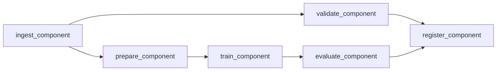

# mlops-benchmark-kubeflow

## Português

`mlops-benchmark-kubeflow` é um benchmark de MLOps organizado com a mentalidade de `Kubeflow Pipelines`, comparando múltiplos modelos em uma DAG com componentes explícitos de ingestão, validação, preparação, treino, avaliação e registro.

### Storytelling técnico

Em MLOps, benchmark não é apenas uma tabela de métricas. Para ser útil em produção, ele precisa nascer dentro de um fluxo reexecutável, em que cada componente deixe rastros claros dos dados usados, das métricas produzidas e do artefato promovido ao final. É esse tipo de disciplina operacional que ferramentas como Kubeflow ajudam a organizar.

Este projeto foi desenhado para mostrar exatamente isso. Em vez de treinar modelos em um notebook isolado, ele estrutura a comparação entre candidatos como uma DAG:

- ingestão do dataset;
- validação estrutural;
- split controlado;
- treino de múltiplos candidatos;
- avaliação com métrica de seleção;
- registro do modelo vencedor.

### Componentes

- [src/data_factory.py](/Users/flaviagaia/Documents/CV_FLAVIA_CODEX/-mlops-benchmark-kubeflow/src/data_factory.py)
- [src/components.py](/Users/flaviagaia/Documents/CV_FLAVIA_CODEX/-mlops-benchmark-kubeflow/src/components.py)
- [src/pipeline_runner.py](/Users/flaviagaia/Documents/CV_FLAVIA_CODEX/-mlops-benchmark-kubeflow/src/pipeline_runner.py)
- [pipeline.py](/Users/flaviagaia/Documents/CV_FLAVIA_CODEX/-mlops-benchmark-kubeflow/pipeline.py)
- [main.py](/Users/flaviagaia/Documents/CV_FLAVIA_CODEX/-mlops-benchmark-kubeflow/main.py)
- [tests/test_pipeline.py](/Users/flaviagaia/Documents/CV_FLAVIA_CODEX/-mlops-benchmark-kubeflow/tests/test_pipeline.py)

### DAG


```

### Resultados atuais

- `runtime_mode = local_kubeflow_style_benchmark`
- `row_count = 1400`
- `positive_rate = 0.5050`
- `selected_model = logistic_regression`
- `logistic_regression roc_auc = 0.7959`
- `logistic_regression average_precision = 0.7971`
- `linear_svc roc_auc = 0.7960`
- `linear_svc average_precision = 0.7967`
- `random_forest roc_auc = 0.7454`
- `random_forest average_precision = 0.7545`

### Observações de benchmark

- O pipeline seleciona o vencedor com base em `average_precision`, priorizando robustez de ranking no benchmark.
- O dataset sintético atual é quase balanceado, então `average_precision` e `roc_auc` ficam relativamente próximos entre si.
- O valor principal do projeto está na organização do benchmark como DAG reexecutável, não só nas métricas isoladas.

### Execução

```bash
python3 main.py
python3 -m unittest discover -s tests -v
python3 -m py_compile main.py pipeline.py src/data_factory.py src/components.py src/pipeline_runner.py
```

## English

`mlops-benchmark-kubeflow` is an MLOps benchmark organized with a `Kubeflow Pipelines` mindset, comparing multiple models through an explicit DAG with ingestion, validation, preparation, training, evaluation, and registration components.

### Current results

- `runtime_mode = local_kubeflow_style_benchmark`
- `row_count = 1400`
- `positive_rate = 0.5050`
- `selected_model = logistic_regression`
- `logistic_regression roc_auc = 0.7959`
- `logistic_regression average_precision = 0.7971`
- `linear_svc roc_auc = 0.7960`
- `linear_svc average_precision = 0.7967`
- `random_forest roc_auc = 0.7454`
- `random_forest average_precision = 0.7545`
